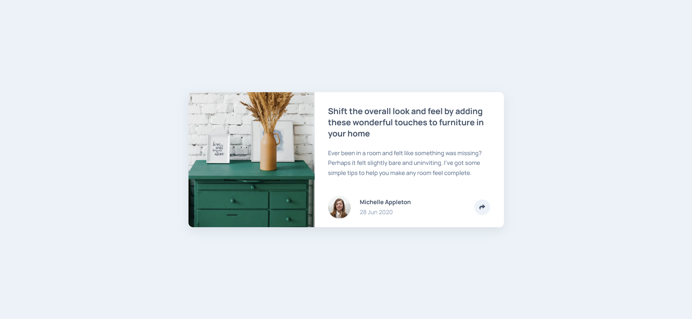

# Frontend Mentor - Article preview component solution

This is a solution to the [Article preview component challenge on Frontend Mentor](https://www.frontendmentor.io/challenges/article-preview-component-dYBN_pYFT). Frontend Mentor challenges help you improve your coding skills by building realistic projects. 

## Overview

### The challenge

Users should be able to:

- View the optimal layout for the component depending on their device's screen size
- See the social media share links when they click the share icon

### Screenshot

### Links

- [Solution URL](https://github.com/tadrochlinski/article-previev-component)
- [Live Site URL](https://tadrochlinski.github.io/article-previev-component/)

### Built with

- HTML
- RWD / mobile first 
- CSS / SCSS
- Flex
- Grid
- VanillaJS (DOM Manipulation)